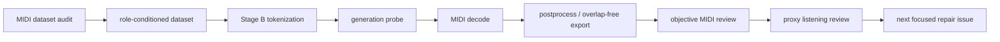

# Jazz Piano MIDI 생성 파이프라인

> symbolic MIDI 기반 재즈 피아노 솔로 생성 모델을 만들기 전에, 생성 결과가 실제로 리뷰 가능한지 검증하는 로컬 실험 파이프라인입니다.

이 프로젝트는 "MIDI 파일이 생성됐다"를 성공으로 보지 않습니다.

생성된 `.mid`를 note 단위로 다시 읽고, phrase coverage, polyphony, dead-air, repeated cell, chord/tension ratio, final landing, IOI/duration diversity 같은 지표로 실패 원인을 분리합니다.

현재 목표는 완성된 재즈 솔로 모델이 아니라, **reviewable jazz solo-line MIDI를 만들 수 있는 tokenization, generation, decoding, evaluation loop를 증명하는 것**입니다.

## 핵심 요약

- Python 기반 symbolic MIDI generation 실험 프로젝트
- Stage A `NOTE_ON/OFF` 방식의 실패 원인을 분석하고 Stage B duration-explicit token으로 전환
- Music Transformer 계열 모델 학습/생성 경로와 grammar-constrained generation probe 구현
- MIDI 파일 생성 후 objective review와 proxy listening review를 반복하는 검증 루프 구축
- 생성물이 one-note, long sustain, chord block, repeated cell인지 자동으로 걸러내는 quality gate 운영
- 현재는 broad training, Brad style adaptation, backend/API, DAW plugin으로 확장하지 않고 model-core 검증에 집중

## 왜 만들었나

처음에는 Brad Mehldau 스타일의 jazz piano MIDI generator를 목표로 시작했습니다. 하지만 작은 dataset으로 바로 학습을 키우면, 모델이 좋아진 것처럼 보이는 `.mid` 파일만 남고 실제로는 다음 문제가 반복됐습니다.

- note count가 너무 적음
- 긴 sustain block
- chord block처럼 보이는 출력
- solo-line이 아닌 동시 발음 구조
- 반복 pitch-class cell
- grid-derived timing stiffness
- final landing이 음악적으로 어색함

그래서 방향을 바꿨습니다.

> 모델을 키우기 전에, 실패를 재현하고 측정할 수 있는 generation/evaluation pipeline을 먼저 만든다.

## 전체 파이프라인



## Stage 전환 기록

### Stage A: control_v1 실패 확인

초기 Stage A는 `NOTE_ON/OFF` 중심의 control token 방식이었습니다. 학습/생성 경로는 runnable했지만 생성 MIDI가 실제 솔로 라인으로 보기 어려웠습니다.

대표 실패:

- one-note collapse
- long sustain block
- chord block 출력
- phrase coverage 부족

결론:

- Stage A를 더 강하게 postprocess하지 않는다.
- duration과 position을 명시하는 Stage B tokenization으로 전환한다.

### Stage B: duration-explicit symbolic probe

Stage B에서는 REMI/Jazz Transformer 계열 판단에 맞춰 다음 token family를 명시했습니다.

- `BAR`
- `POSITION`
- `CHORD_ROOT`
- `CHORD_QUALITY`
- `NOTE_PITCH`
- `NOTE_DURATION`
- `VELOCITY`

이후 2-bar/4-bar/8-bar phrase window 단위로 generation probe를 만들고, 생성된 MIDI를 다시 note-level로 평가했습니다.

## 주요 구현 내용

### 1. Dataset audit

전체 jazz piano MIDI corpus를 먼저 audit했습니다.

- active dataset tree: `midi_dataset/midi`
- readable files: `2777`
- candidate files: `2775`
- candidate non-Brad files: `2703`
- candidate Brad files: `72`
- exact duplicate hash groups: `0`

Brad dataset은 바로 scratch training에 쓰지 않고, generic jazz base 이후 adaptation/holdout 후보로 분리했습니다.

### 2. Stage B generation probes

작은 실험을 여러 단계로 쪼개서 검증했습니다.

- grammar-constrained generation
- overlap/dedup gate
- temporal coverage diagnostics
- coverage-aware constrained generation
- chord-aware pitch constrained generation
- data-derived motif rhythm generation
- phrase/cadence review baseline
- register-safe final landing repair
- data-derived timing phrase vocabulary repair

각 probe는 "좋은 MIDI 하나"가 아니라 여러 sample의 pass-rate와 failure reason을 남기도록 만들었습니다.

### 3. Objective MIDI review

생성된 MIDI를 다시 읽어서 다음 기준으로 검사합니다.

- non-zero note count
- unique pitch count
- max simultaneous notes
- polyphonic tick ratio
- phrase coverage
- dead-air ratio
- max note duration ratio
- repeated pitch/cell ratio
- max interval
- unresolved large leap ratio
- chord-tone/tension/outside/root ratio
- final guide/chord landing
- IOI/duration diversity

`valid .mid exists`는 성공 조건이 아닙니다.

### 4. Proxy listening review

실제 오디오 청취 전 단계로, MIDI note sequence와 context MIDI를 기준으로 proxy review notes를 채웁니다.

최근 review 결과:

- Issue #164: `Stage B data-derived timing phrase repaired proxy review`
- reviewed candidates: `6`
- `keep`: `0`
- `needs_followup`: `5`
- `reject`: `1`
- timing: `acceptable=2`, `too_stiff=4`
- objective bucket: `clean=6`
- objective flags: `{}`

해석:

- objective-clean 후보는 만들 수 있지만, 아직 최종 keep 후보는 없습니다.
- 다음 병목은 phrase vocabulary와 duration/IOI diversity입니다.

## 최근 개선 예시

Issue #168에서는 `data_motif_rhythm_phrase_variation`에 phrase-level duration/IOI bar-position plan을 추가했습니다.

결과:

| metric | 이전 | 이후 |
|---|---:|---:|
| strict valid | 3/3 | 3/3 |
| final landing resolved | 3/3 | 3/3 |
| max interval | 4 | 4 |
| objective MIDI flags | `{}` | `{}` |
| avg syncopated onset ratio | 0.693 | 0.682 |
| avg tension ratio | 0.375 | 0.375 |
| avg duration diversity ratio | 0.073 | 0.078 |
| avg IOI diversity ratio | 0.079 | 0.111 |
| avg most-common IOI ratio | 0.392 | 0.481 |

duration/IOI diversity는 개선됐지만 most-common IOI 반복은 악화됐습니다. 그래서 이 변경도 "성공"으로 확정하지 않고, 다음 proxy review에서 tradeoff로 판단합니다.

## 현재 상태

현재 main 기준 최신 판단:

- latest completed: Issue #168
- 다음 권장 작업: `Stage B duration IOI repaired proxy review`
- broad training: 아직 진행하지 않음
- Brad style adaptation: 아직 진행하지 않음
- backend/API/product MVP: 범위 밖

현재 가장 중요한 원칙:

> objective-clean MIDI를 만들었다고 해서 음악적으로 좋은 솔로라고 주장하지 않는다.

## 기술 스택

- Python
- PyTorch 기반 Music Transformer 실험 코드
- pretty_midi
- NumPy
- unittest
- Bash harness
- MIDI tokenization / decoding / postprocess pipeline

## 주요 파일

```text
scripts/
  prepare_role_dataset.py
  run_stage_b_generation_probe.py
  run_stage_b_data_motif_generation_compare.py
  review_midi_note_objectives.py
  build_listening_review_notes.py
  summarize_listening_review_notes.py
  agent_harness.sh

inference/app/
  generator.py
  metrics.py
  postprocess.py

docs/
  CURRENT_STATUS_AND_PLAN.md
  CORE_PLAN.md
  STAGE_B_*.md
```

## 실행 방법

환경 설치:

```bash
pip install -r requirements.txt
```

빠른 검증:

```bash
bash scripts/agent_harness.sh quick
```

Stage B rhythm/phrase variation probe:

```bash
bash scripts/agent_harness.sh stage-b-rhythm-phrase-variation
```

listening review aggregate:

```bash
bash scripts/agent_harness.sh stage-b-listening-review-aggregate
```

## 포트폴리오 관점에서 보여줄 수 있는 점

이 프로젝트에서 중요한 것은 "AI로 음악을 만들었다"가 아니라, 모델 출력 실패를 엔지니어링 문제로 분해한 과정입니다.

- 생성 결과를 파일 존재 여부가 아니라 note-level metric으로 검증
- 실패한 Stage A를 고집하지 않고 representation 문제로 재정의
- Stage B tokenization, constrained generation, review gate를 단계적으로 구축
- 각 실험을 issue 단위로 나누고, 결과가 나쁘면 그 이유를 다음 실험 조건으로 연결
- 성능을 과장하지 않고 현재 한계와 다음 병목을 문서화

## 현재 한계

- 아직 final `keep` 후보가 없습니다.
- timing stiffness와 phrase vocabulary 문제가 남아 있습니다.
- Brad style adaptation을 주장할 단계가 아닙니다.
- 실시간 DAW/plugin, backend/API, product MVP는 아직 후순위입니다.

## 다음 작업

```text
Stage B duration IOI repaired proxy review
```

목표:

- Issue #168의 duration/IOI objective repair 후보를 MIDI-note/context 기준으로 검토
- IOI diversity 개선이 실제로 덜 mechanical한 phrase로 이어졌는지 확인
- most-common IOI 악화 tradeoff를 proxy review에서 분리
- proxy keep이 없으면 broad training으로 넘어가지 않음

## 문서

- [Current Status and Plan](docs/CURRENT_STATUS_AND_PLAN.md)
- [Core Plan](docs/CORE_PLAN.md)
- [References](docs/REFERENCES.md)
