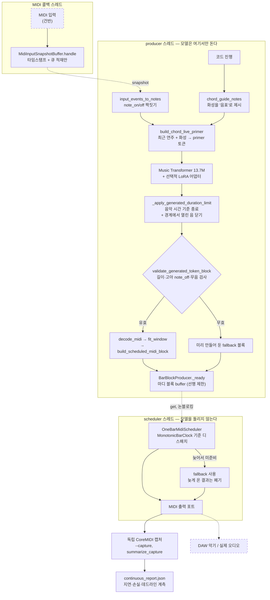
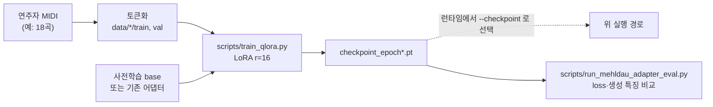

# 실시간 재즈 MIDI 즉흥연주

사람이 건반을 치면, 방금 친 것과 코드 진행을 문맥으로 **다음 마디의 재즈 솔로를
만들어 MIDI 로 내보내는** 로컬 실험 프로젝트입니다. 내보낸 MIDI 를 DAW 악기에
연결하면 소리가 납니다.

> **현재 상태**: 연속 생성·전송 배선은 가상 CoreMIDI 환경에서 검증했습니다.
> **음악적 품질, 실물 키보드·FL Studio 협연, 연주자 스타일 적응은 모두 미검증입니다.**

---

## 1. 무엇을 만들려는가

### 입력과 출력

| | |
|---|---|
| **입력** | ① 연주자의 MIDI 노트(선택) ② 코드 진행 ③ BPM·마디 수 |
| **처리** | 최근 연주 + 화성을 문맥으로 Music Transformer 가 한 마디씩 생성 |
| **출력** | MIDI 노트를 마디 시각에 맞춰 포트로 전송 → DAW 악기가 연주 |

### 쓰는 모습

```
연주자: Dm7 위에서 몇 마디 친다
  ↓
시스템: 그 연주를 primer 로 삼아 다음 마디 솔로를 만들어 둔다
  ↓
다음 마디 첫 박: 만들어 둔 솔로를 DAW 로 내보낸다  (연주자는 계속 치고 있다)
  ↓
반복
```

핵심은 **"재생하면서 다음 것을 만든다"** 입니다. 마디가 끝나고 생각하기 시작하면
이미 늦습니다.

최종 목표는 여기에 **연주자 본인의 스타일 적응**을 얹는 것입니다. 그 단계는
아직 성공하지 못했습니다(§5).

---

## 2. 실제 구현 아키텍처

아래 도식은 `scripts/run_continuous_jazz.py` 의 실행 경로입니다.
**점선 상자는 아직 검증되지 않은 구간**입니다.


```mermaid
flowchart TD
    subgraph CB["MIDI 콜백 스레드"]
        IN["MIDI 입력<br/>(건반)"] --> BUF["MidiInputSnapshotBuffer.handle<br/>타임스탬프 + 큐 적재만"]
    end

    subgraph PROD["producer 스레드 — 모델은 여기서만 돈다"]
        BUF -.snapshot.-> N2N["input_events_to_notes<br/>note_on/off 짝짓기"]
        CHORD["코드 진행"] --> GUIDE["chord_guide_notes<br/>화성을 '음표'로 제시"]
        N2N --> PRIMER["build_chord_live_primer<br/>최근 연주 + 화성 → primer 토큰"]
        GUIDE --> PRIMER
        PRIMER --> GEN["Music Transformer 13.7M<br/>+ 선택적 LoRA 어댑터"]
        GEN --> DUR["_apply_generated_duration_limit<br/>음악 시간 기준 종료<br/>+ 경계에서 열린 음 닫기"]
        DUR --> VAL{"validate_generated_token_block<br/>길이·고아 note_off·무음 검사"}
        VAL -->|유효| DEC["decode_midi → fit_window<br/>→ build_scheduled_midi_block"]
        VAL -->|무효| FB["미리 만들어 둔 fallback 블록"]
        DEC --> READY["BarBlockProducer._ready<br/>마디 블록 buffer (선행 제한)"]
        FB --> READY
    end

    subgraph SCHED["scheduler 스레드 — 모델을 돌리지 않는다"]
        READY -.get, 논블로킹.-> SC["OneBarMidiScheduler<br/>MonotonicBarClock 기준 디스패치"]
        SC -->|늦어서 미준비| FB2["fallback 사용<br/>늦게 온 결과는 폐기"]
        SC --> OUT["MIDI 출력 포트"]
        FB2 --> OUT
    end

    OUT --> CAP["독립 CoreMIDI 캡처<br/>--capture, summarize_capture"]
    OUT -.-> DAW["DAW 악기 / 실제 오디오"]

    CAP --> REPORT["continuous_report.json<br/>지연·손실·데드라인 계측"]

    style DAW stroke-dasharray: 5 5
    style IN stroke-dasharray: 5 5
```

### 도식이 말하는 설계 규칙

| 규칙 | 이유 |
|---|---|
| MIDI 콜백은 타임스탬프·적재만 | 콜백에서 일하면 CoreMIDI 가 막힌다 |
| 모델은 producer 스레드에서만 | scheduler 가 블로킹되면 마디 경계를 놓친다 |
| scheduler 의 블록 조회는 논블로킹 | 준비 안 됐으면 즉시 fallback |
| 늦게 온 생성 결과는 폐기 | 이미 지나간 입력을 조건으로 만든 블록이다 |
| fallback 은 **미리** 만들어 둔다 | 그때 만들면 그것도 지연이 된다 |
| 종료 시 `reset()` → `panic()` 보장 | 정상·중단·예외·Ctrl-C 모두 |

### 학습 흐름 (별도, 오프라인)


```mermaid
flowchart LR
    MIDI["연주자 MIDI<br/>(예: 18곡)"] --> TOK["토큰화<br/>data/*/train, val"]
    TOK --> TRAIN["scripts/train_qlora.py<br/>LoRA r=16"]
    BASE["사전학습 base<br/>또는 기존 어댑터"] --> TRAIN
    TRAIN --> CKPT["checkpoint_epoch*.pt"]
    CKPT -.런타임에서 --checkpoint 로 선택.-> USE["위 실행 경로"]
    CKPT --> EVAL["scripts/run_mehldau_adapter_eval.py<br/>loss·생성 특징 비교"]
```

---

## 3. 지금까지 한 일

원시 수치보다 **어떤 문제를 어떻게 풀었는지** 위주입니다.

| 해결한 문제 | 방법 | 상태 |
|---|---|---|
| 생성이 마디 길이를 안 지킴 | 음악 시간 기준으로 종료하고, 경계에서 열린 음을 닫음 | ✅ 완료 |
| 생성된 노트가 **소리가 안 남** | Stage A 는 velocity 를 상태로 들고 간다. primer 를 떼면 그 상태가 사라져 note-on 이 velocity 0(=note-off) 으로 디코딩됐다. 상태를 되살리도록 수정 | ✅ 완료 |
| 한 마디 실패가 연주 전체를 중단 | 무효·지각 블록을 미리 만든 fallback 으로 대체 | ✅ 완료 |
| 재생 중 다음 마디 생성 | 스케줄러를 고치지 않고 producer 를 live view 로 끼움 | ✅ 완료 |
| 연주 입력이 생성에 반영 안 됨 | 콜백 → snapshot → primer 경로 연결 | ✅ 배선 완료 |
| 코드 진행이 생성에 반영 안 됨 | 모델이 코드 심볼을 학습한 적 없음을 확인 → **화성을 음표로** 제시하는 primer | ⚠️ 제한적 (§4) |
| 연주자 스타일 적응 | 멜다우 18곡으로 LoRA 학습, 두 출발점 비교 | ❌ 효과 미입증 (§5) |

### 확인된 제약 두 가지

- **모델은 코드 심볼 토큰을 학습한 적이 없습니다.** 베이스 학습셋과 적응
  학습셋 모두 제어 토큰이 0회 등장하고, LoRA 는 임베딩을 갱신하지 않았습니다.
  그래서 코드 유도는 **학습된 조건 제어가 아니라 음표 기반 유도**입니다.
- **primer 의 텍스처가 출력 텍스처를 좌우합니다.** 같은 모델이 설정에 따라
  마디당 노트 수가 크게 달랐습니다.

---

## 4. 증거 — 무엇을 어떤 조건에서 쟀는가

측정 항목을 섞지 않는 것이 중요합니다. **네 가지는 서로 다른 값입니다.**

| 항목 | 의미 |
|---|---|
| `generation` | 모델 생성 시간만 |
| `input_to_ready` | 입력 도달 → 생성 완료. **반응 속도로 읽을 값** |
| `input_to_bar_start` | 위 + 다음 마디까지 대기. 마디 길이에 묶이므로 모델 속도가 아님 |
| `scheduled_to_capture` | 예정 재생 시각 → 독립 캡처 관측. 출력 경로만 |

### 기록된 실행

**조건**: macOS CoreMIDI **가상** 포트, 8마디 × 4회 = 32마디, 128 BPM,
`FORCE_CPU=1`, 부하 없는 단독 실행, 독립 캡처 켬.

| 결과 | 값 |
|---|---|
| 완주 | 4/4 |
| 모델 생성 마디 | 32/32, 오류 0 |
| 캡처된 노트 이벤트 | **532/532**, 손실 0 · 중복 0 · 순서 오류 0 |
| 데드라인 미스 | 0 |

**이 수치가 말하지 않는 것**: 장시간 안정성, 부하 상태 동작, 실제 소리,
음악적 품질. 짧은 단발 실행입니다.

### 테스트

`scripts/agent_harness.sh quick` — **169 tests 통과** (본 문서 작성 시점 실행).

`demo` 의 기본 경로는 **fallback-only** 입니다. 배선 확인용이며
**모델의 음악적 품질 근거가 아닙니다.**

---

## 5. 멜다우 개인화 — 효과를 확인하지 못했습니다

- **데이터**: 18곡 (적응 train 16 / validation 2, 곡 단위 분리)
- **학습**: LoRA r=16, 8 epoch, seed 42. 일반 재즈 base 와 기존 Tatum-adapted
  두 출발점 각각에 적용. **기존 체크포인트는 덮어쓰지 않았습니다**
- **관측**: 평가 loss 변화 약 **−0.007 / −0.006**(각 출발점 대비).
  생성 특징에서 뚜렷한 개인화 효과를 확인하지 못했습니다
- **런타임**: 학습한 어댑터를 명시 선택해 기존 실행 경로에서 load·generate
  되는 것까지 확인

### 평가의 한계 (원인 규명과 구분할 것)

18곡 모두 base 학습 데이터와 토큰 시퀀스가 일치하고, validation 2곡도 base
train 에 포함됩니다. 따라서 **새 멜다우 곡에 대한 일반화는 평가할 수 없습니다.**

**다만 이 중복이 "적응 효과가 작은 원인" 으로 입증된 것은 아닙니다.**
학습 설정, 업데이트 크기, 평가 지표의 민감도도 아직 확인하지 않은 후보입니다.
독립적인 원인 검증은 하지 않았습니다.

### 사용자 초기 청취 의견

> "느낌은 비슷하고, 베이스 음 뒤에 솔로 같은 선율이 나오고 다시 베이스 음,
> 이것의 반복"

특정 8마디 실행에서 22개 노트가 나왔고 일부 마디의 pitch 가 두 어댑터 간
동일했습니다. **이는 그 설정에서의 관찰입니다.** "솔로가 아니다",
"어댑터가 무효임이 입증됐다", "primer 를 바꾸면 밀도가 보장된다" 같은 결론은
아직 근거가 없습니다. 블라인드 스타일 평가도 하지 않았습니다.

비교 파일: `outputs/mehldau_eval/{base,tatum,mehldau_from_base,mehldau_from_tatum}.wav`
상세: [멜다우 개인화 실험](docs/experiments/MEHLDAU_PERSONALIZATION.md)

---

## 6. 빠르게 실행하기

Python 환경과 의존성은 `uv` 로 준비합니다. CoreMIDI 검증은 macOS 기준입니다.

### 체크포인트 없이 — 배선만 확인

```bash
bash scripts/run_continuous_demo.sh
```

deterministic fallback 으로 돌며 가상 포트 캡처까지 확인합니다.
**모델을 쓰지 않으므로 음악 품질과 무관합니다.**

### 모델 필요 — 실제 생성

```bash
CHECKPOINT=/path/to/checkpoint.pt PRIMER=/path/to/conditioning.mid \
  bash scripts/run_continuous_demo.sh
```

코드 진행 유도를 켜려면:

```bash
FORCE_CPU=1 uv run --with-requirements requirements.txt python scripts/run_continuous_jazz.py \
  --checkpoint /path/to/checkpoint.pt --conditioning-midi /path/to/conditioning.mid \
  --bars 8 --bpm 128 --capture --chord-primer --chord-blocks-per-bar 2 \
  --output-dir outputs/continuous/chord_demo
```

### 실물 장비 (미검증 경로)

```bash
CHECKPOINT=... PRIMER=... INPUT_PORT="keyboard port" OUTPUT_PORT="DAW port" \
  bash scripts/run_continuous_demo.sh
```

### 검증

```bash
uv run --with-requirements requirements.txt bash scripts/agent_harness.sh quick
uv run --with-requirements requirements.txt bash scripts/agent_harness.sh demo
```

### 산출물

| 경로 | 내용 |
|---|---|
| `outputs/continuous/<run>/continuous_report.json` | 지연·손실·데드라인 계측 |
| `outputs/continuous/<run>/played.mid` | 실제로 디스패치된 노트 |
| `outputs/mehldau_eval/` | 어댑터 비교 MIDI·WAV·리포트 |

가상 포트 검증만으로는 소리가 나지 않습니다. MIDI 를 DAW 악기에 연결하거나
`played.mid` 를 가져와 들어야 합니다. **WAV 는 사인 합성 참고음이며 음색
평가의 근거가 아닙니다.** 체크포인트·원본 데이터는 저장소에 없습니다.

---

## 7. 한계 — 주장하지 않는 것

- **실물 키보드·FL Studio 연주 미검증.** 위 측정의 "키보드" 는 가상 소스입니다
- **장시간 안정성 미검증.** 8~32마디 단발 실행만 했습니다
- **음악적 품질 미검증.** 자동 지표는 품질 판정이 아닙니다
- **멜다우 스타일 적응 성공 미입증** (§5)
- **부하 상태 미측정.** DAW·신스 동시 구동 조건에서 재측정이 필요합니다

전송 성공, 제시간 생성, 좋은 음악은 **서로 다른 기준**입니다.
이 저장소는 공연용으로 검증된 완제품이 아닙니다.

---

## 8. 재개할 한 작업

**실물 키보드와 DAW 를 연결해 한 번 들어보기.** 지금까지의 측정은 전부 가상
포트에서 이뤄졌고, 자동 지표로는 더 나아갈 수 없는 지점에 와 있습니다.
사람이 실제로 듣고 나서야 다음 최적화 대상을 고를 수 있습니다.

---

## 문서

- [재개 위치·실행 방법·알려진 제한](docs/phase1/RESUME_HANDOFF.md)
- [연속 런타임 구조](docs/phase1/CONTINUOUS_PATH.md)
- [생성 지연 측정](docs/phase1/GENERATION_LATENCY.md) · [구간별 예산](docs/phase1/LATENCY_BUDGET.md)
- [코드 primer 비교 실험](docs/experiments/CHORD_PRIMER_AB.md)
- [멜다우 개인화 실험](docs/experiments/MEHLDAU_PERSONALIZATION.md)
- [기존 D0–D4 연구 기록](docs/RESEARCH_SUMMARY.md)

과거 Stage B 실험은 `archive/` 와 연구 문서에 보존합니다.
현재 실행 진입점은 위 연속 런타임입니다.
