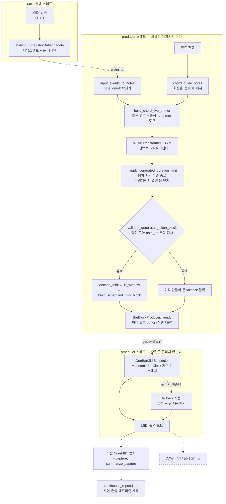
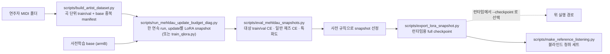

# 실시간 재즈 MIDI 즉흥연주

사람이 건반을 치면, 방금 친 것과 코드 진행을 문맥으로 **다음 마디의 재즈 솔로를
만들어 MIDI 로 내보내는** 로컬 실험 프로젝트입니다. 내보낸 MIDI 를 DAW 악기에
연결하면 소리가 납니다.

> **현재 상태**: 연속 생성·전송 배선은 가상 CoreMIDI 환경에서 검증했습니다.
> **음악적 품질, 실물 키보드·FL Studio 협연, 연주자 스타일 적응은 모두 미검증입니다.**

---

## 1. 무엇을 만들려는가

### 입력과 출력

| | |
|---|---|
| **입력** | ① 연주자의 MIDI 노트(선택) ② 코드 진행 ③ BPM·마디 수 |
| **처리** | 최근 연주 + 화성을 문맥으로 Music Transformer 가 한 마디씩 생성 |
| **출력** | MIDI 노트를 마디 시각에 맞춰 포트로 전송 → DAW 악기가 연주 |

### 쓰는 모습

```
연주자: Dm7 위에서 몇 마디 친다
  ↓
시스템: 그 연주를 primer 로 삼아 다음 마디 솔로를 만들어 둔다
  ↓
다음 마디 첫 박: 만들어 둔 솔로를 DAW 로 내보낸다  (연주자는 계속 치고 있다)
  ↓
반복
```

핵심은 **"재생하면서 다음 것을 만든다"** 입니다. 마디가 끝나고 생각하기 시작하면
이미 늦습니다.

최종 목표는 여기에 **연주자 스타일 적응**을 얹는 것입니다. 멜다우는 **가능도 수준 개인화 완료**(멜다우를 한 번도 안 본 base에서 처음 보는 멜다우 곡 예측이 개선, 청취 미검증, #1497). 멜다우·Art Tatum으로
시험한 결과, 어댑터는 모델 수치상 대상 스타일로 특화됩니다(Tatum은 학습하지 않은 곡까지).
다만 귀로 들리는 차이는 아직 확인하지 못했습니다(§5).

---

## 2. 실제 구현 아키텍처

아래 도식은 `scripts/run_continuous_jazz.py` 의 실행 경로입니다.
**점선 상자는 아직 검증되지 않은 구간**입니다.


```mermaid
flowchart TD
    subgraph CB["MIDI 콜백 스레드"]
        IN["MIDI 입력<br/>(건반)"] --> BUF["MidiInputSnapshotBuffer.handle<br/>타임스탬프 + 큐 적재만"]
    end

    subgraph PROD["producer 스레드 — 모델은 여기서만 돈다"]
        BUF -.snapshot.-> N2N["input_events_to_notes<br/>note_on/off 짝짓기"]
        CHORD["코드 진행"] --> GUIDE["chord_guide_notes<br/>화성을 '음표'로 제시"]
        N2N --> PRIMER["build_chord_live_primer<br/>최근 연주 + 화성 → primer 토큰"]
        GUIDE --> PRIMER
        PRIMER --> GEN["Music Transformer 13.7M<br/>+ 선택적 LoRA 어댑터"]
        GEN --> DUR["_apply_generated_duration_limit<br/>음악 시간 기준 종료<br/>+ 경계에서 열린 음 닫기"]
        DUR --> VAL{"validate_generated_token_block<br/>길이·고아 note_off·무음 검사"}
        VAL -->|유효| DEC["decode_midi → fit_window<br/>→ build_scheduled_midi_block"]
        VAL -->|무효| FB["미리 만들어 둔 fallback 블록"]
        DEC --> READY["BarBlockProducer._ready<br/>마디 블록 buffer (선행 제한)"]
        FB --> READY
    end

    subgraph SCHED["scheduler 스레드 — 모델을 돌리지 않는다"]
        READY -.get, 논블로킹.-> SC["OneBarMidiScheduler<br/>MonotonicBarClock 기준 디스패치"]
        SC -->|늦어서 미준비| FB2["fallback 사용<br/>늦게 온 결과는 폐기"]
        SC --> OUT["MIDI 출력 포트"]
        FB2 --> OUT
    end

    OUT --> CAP["독립 CoreMIDI 캡처<br/>--capture, summarize_capture"]
    OUT -.-> DAW["DAW 악기 / 실제 오디오"]

    CAP --> REPORT["continuous_report.json<br/>지연·손실·데드라인 계측"]

    style DAW stroke-dasharray: 5 5
    style IN stroke-dasharray: 5 5
```

### 도식이 말하는 설계 규칙

| 규칙 | 이유 |
|---|---|
| MIDI 콜백은 타임스탬프·적재만 | 콜백에서 일하면 CoreMIDI 가 막힌다 |
| 모델은 producer 스레드에서만 | scheduler 가 블로킹되면 마디 경계를 놓친다 |
| scheduler 의 블록 조회는 논블로킹 | 준비 안 됐으면 즉시 fallback |
| 늦게 온 생성 결과는 폐기 | 이미 지나간 입력을 조건으로 만든 블록이다 |
| fallback 은 **미리** 만들어 둔다 | 그때 만들면 그것도 지연이 된다 |
| 종료 시 `reset()` → `panic()` 보장 | 정상·중단·예외·Ctrl-C 모두 |

### 학습 흐름 (별도, 오프라인)


```mermaid
flowchart LR
    MIDI["연주자 MIDI 폴더"] --> TOK["scripts/build_artist_dataset.py<br/>곡 단위 train/val + base 중복 manifest"]
    TOK --> TRAIN["scripts/run_mehldau_update_budget_diag.py<br/>한 연속 run, update별 LoRA snapshot<br/>(또는 train_qlora.py)"]
    BASE["사전학습 base (armB)"] --> TRAIN
    TRAIN --> EVAL["scripts/eval_mehldau_snapshots.py<br/>대상 train/val CE · 일반 재즈 CE · 특화도"]
    EVAL --> PICK["사전 규칙으로 snapshot 선정"]
    PICK --> EXP["scripts/export_lora_snapshot.py<br/>런타임용 full checkpoint"]
    EXP -.런타임에서 --checkpoint 로 선택.-> USE["위 실행 경로"]
    EXP --> LISTEN["scripts/make_reference_listening.py<br/>블라인드 청취 세트"]
```

---

## 3. 지금까지 한 일

원시 수치보다 **어떤 문제를 어떻게 풀었는지** 위주입니다.

| 해결한 문제 | 방법 | 상태 |
|---|---|---|
| 생성이 마디 길이를 안 지킴 | 음악 시간 기준으로 종료하고, 경계에서 열린 음을 닫음 | ✅ 완료 |
| 생성된 노트가 **소리가 안 남** | Stage A 는 velocity 를 상태로 들고 간다. primer 를 떼면 그 상태가 사라져 note-on 이 velocity 0(=note-off) 으로 디코딩됐다. 상태를 되살리도록 수정 | ✅ 완료 |
| 한 마디 실패가 연주 전체를 중단 | 무효·지각 블록을 미리 만든 fallback 으로 대체 | ✅ 완료 |
| 재생 중 다음 마디 생성 | 스케줄러를 고치지 않고 producer 를 live view 로 끼움 | ✅ 완료 |
| 연주 입력이 생성에 반영 안 됨 | 콜백 → snapshot → primer 경로 연결 | ✅ 배선 완료 |
| 코드 진행이 생성에 반영 안 됨 | 모델이 코드 심볼을 학습한 적 없음을 확인 → **화성을 음표로** 제시하는 primer | ⚠️ 제한적 (§4) |
| 연주자 스타일 적응이 안 움직임 | 원인 진단: 실제 optimizer update가 **8회**였음. 한 연속 run에서 update를 늘려 비교 | ✅ 원인 규명 (§5) |
| 연주자 스타일 개인화 | 멜다우·Art Tatum LoRA 어댑터. 모델 우도로는 특화 확인, Tatum은 미학습 곡까지 | ⚠️ 들리는지는 미확인 (§5) |

### 확인된 제약 두 가지

- **모델은 코드 심볼 토큰을 학습한 적이 없습니다.** 베이스 학습셋과 적응
  학습셋 모두 제어 토큰이 0회 등장하고, LoRA 는 임베딩을 갱신하지 않았습니다.
  그래서 코드 유도는 **학습된 조건 제어가 아니라 음표 기반 유도**입니다.
- **primer 의 텍스처가 출력 텍스처를 좌우합니다.** 같은 모델이 설정에 따라
  마디당 노트 수가 크게 달랐습니다.

---

## 4. 증거 — 무엇을 어떤 조건에서 쟀는가

측정 항목을 섞지 않는 것이 중요합니다. **네 가지는 서로 다른 값입니다.**

| 항목 | 의미 |
|---|---|
| `generation` | 모델 생성 시간만 |
| `input_to_ready` | 입력 도달 → 생성 완료. **반응 속도로 읽을 값** |
| `input_to_bar_start` | 위 + 다음 마디까지 대기. 마디 길이에 묶이므로 모델 속도가 아님 |
| `scheduled_to_capture` | 예정 재생 시각 → 독립 캡처 관측. 출력 경로만 |

### 기록된 실행

**조건**: macOS CoreMIDI **가상** 포트, 8마디 × 4회 = 32마디, 128 BPM,
`FORCE_CPU=1`, 부하 없는 단독 실행, 독립 캡처 켬.

| 결과 | 값 |
|---|---|
| 완주 | 4/4 |
| 모델 생성 마디 | 32/32, 오류 0 |
| 캡처된 노트 이벤트 | **532/532**, 손실 0 · 중복 0 · 순서 오류 0 |
| 데드라인 미스 | 0 |

**이 수치가 말하지 않는 것**: 장시간 안정성, 부하 상태 동작, 실제 소리,
음악적 품질. 짧은 단발 실행입니다.

### 테스트

`tests/` 전체 unittest — **197 tests 통과** (2026-09-27, `FORCE_CPU=1`).

`demo` 의 기본 경로는 **fallback-only** 입니다. 배선 확인용이며
**모델의 음악적 품질 근거가 아닙니다.**

---

## 5. 연주자 스타일 개인화 — 모델 수치로는 특화, 들리는지는 미확인

판정 기준은 모두 실행 전에 문서에 등록했고, 기준에 미달한 결과도 그대로 기록했습니다.
공통 설정: base(armB, 2,777곡 사전학습)에 out_proj LoRA r16을 붙였고, batch 4, accumulation 4, lr 3e-4로 로컬 MPS에서 학습했습니다.
**특화도** = (대상 곡 CE 변화) − (일반 재즈 곡 CE 변화)이며, 음수일수록 대상 쪽으로 특화된 것입니다. CE는 label smoothing 없이 쟀습니다.

### 먼저 바로잡은 것
- **첫 멜다우 run의 "효과 없음"은 학습량 문제였습니다.** 실제 optimizer update는 64가 아니라 **8회**였습니다(16곡 / batch 4 / accumulation 4 = epoch당 1회). 저장·로드와 gradient 경로에는 결함이 없었습니다
- `train_qlora.py`의 cosine 스케줄이 배치 수 기준이라 lr이 거의 감쇠하지 않았습니다 → optimizer update 기준으로 고쳤습니다(기존 동작은 `--scheduler_steps legacy_batches`)
- 지금까지 "Tatum-adapted"로 불린 체크포인트(D1 Arm D)는 실제로는 **Brad Mehldau 18곡의 오른손 파트로 학습**한 것이었습니다

### 멜다우 (18곡 → train 16 / val 2)
| update | 멜다우 train CE | 일반 재즈 CE | 특화도 |
|---|---|---|---|
| 8 (첫 run) | −0.020 | −0.009 | −0.011 |
| **128** | **−0.133** | **−0.002** | **−0.131** |
| 512 | −0.199 | +0.025 | −0.224 |

- 이득의 대부분은 **학습한 16곡 자체에 대한 적합**입니다(val 2곡은 update 64 이후 개선되지 않음)
- 청취 2회(블라인드 A/B, 실제 멜다우 기준 제시형)는 모두 **지지 없음**이었습니다. 사용자 의견: "사투리 구분처럼 모호하다"
- 생성 스타일 descriptor 지표 2종은 타당성 기준(균형 정확도 0.75)에 미달했습니다(0.734)

### Art Tatum (122곡 → train 110 / val 12, 어댑터 미학습)
| update | Tatum val CE (미학습 12곡) | 일반 재즈 CE | 특화도 |
|---|---|---|---|
| 70 | −0.043 | −0.016 | −0.027 |
| 133 | −0.055 | −0.012 | −0.042 |
| **518** | **−0.068** | **−0.004** | **−0.063** |

- **학습 곡 이득(−0.073)이 학습하지 않은 곡으로 거의 그대로 이어집니다.** 일반 재즈 성능은 끝까지 나빠지지 않았습니다
- 사용자가 들은 단서 "빠른 속주"를 지표로 쟀습니다. 40–120 ms 간격 비율은 실제 Tatum 0.44 / 일반 재즈 0.21이고, 생성은 원래 모델 0.33 → **Tatum 어댑터 0.43**으로 올랐습니다. 95% CI 하한이 +0.0003이라 경계선입니다
- 청취: 6쌍 중 1쌍만 응답했습니다("pair4_B가 가장 Tatum 같다, 빠른 속주"). **판정 미완**
- 16-gram 복사율은 두 아티스트 모두 0입니다

### 해석의 한계
- 멜다우와 Tatum 곡 **모두 base 사전학습셋에 들어 있습니다.** Tatum val은 "어댑터가 보지 않은 곡"일 뿐 base는 봤습니다. 완전히 새로운 곡에 대한 일반화는 아닙니다
- 우도 특화는 들리는 스타일과 같지 않습니다. 들리는 차이는 아직 확인되지 않았습니다

### 런타임에서 쓰기
| 어댑터 | 체크포인트 (gitignore) | 런타임 스모크 (8마디, CPU) |
|---|---|---|
| 멜다우 u128 | `outputs/mehldau_lora_v2/u128/checkpoint_update128.pt` | 8/8, 오류 0, 생성 p50 404 ms |
| 멜다우 u64 (이전 후보, armB 위) | `outputs/mehldau_apply/export_outproj_u64/checkpoint_update64.pt` | 128 BPM 8/8, fallback 0, 생성 p50 355 ms. val 2곡 기준 사전 규칙으로 선정(val −0.023, 일반 −0.012). QKV 확장은 16곡에서 과적합해 기준 미달(#1495) |
| **Tatum 완성 모델 (기본)** | `outputs/final_tatum/export/checkpoint_update518.pt` | 공통 base(Tatum·멜다우 미학습) + out_proj+QKV, Tatum 98곡, val12로 선택. **미학습 Tatum fresh12 CE −0.126**(16곡 모델의 2.3배), 일반 재즈 +0.009, 멜다우 곡 +0.052(Tatum 특이적). 복사 0, 128 BPM 16마디 fallback 0(#1509) |
| **멜다우 개인화 (완료 판정)** | `outputs/clean_base/c2_export/checkpoint_update128.pt` | **멜다우 미학습 base** + out_proj LoRA 128 update. 미학습 멜다우 곡 CE −0.046(4-fold 4/4), 재사용 holdout 2곡 −0.047·특화도 −0.021, 복사 0, 128 BPM 8/8. 가능도 수준 완료, 청취 미검증(#1497). 학습량 확장 CV(64–384, #1511)에서도 held-out 개선이 64–128에서 포화해 이 모델을 유지. 공통 base 멜다우보다 절대 CE가 0.028 낮아(16/16곡) base 통합도 하지 않음(#1517) |
| **Tatum vs 멜다우 비교용 (공통 base)** | `outputs/tvm/export_{tatum,mehldau}/checkpoint_update128.pt` | 두 연주자 모두 제외한 공통 base + 같은 out_proj LoRA·16곡·128 update. 둘 다 자기 연주자 미학습 곡 개선·일반 대비 특화(3×3 교차 평가). 우열은 가중 방식에 따라 뒤집혀 미확정(멜다우 holdout 2곡). 128 BPM 8/8(#1499) |

**한 세션에서 Tatum↔멜다우 전환 (#1519):** `--swap-adapter mehldau=<ckpt> --adapter-schedule tatum:4,mehldau:4`. 마디 시작에서 병합된 어댑터 가중치를 바꿔 끼운다. 같은 base면 LoRA가 건드린 12개 텐서만 복사하고, 다른 base면 `--allow-different-bases`로 전체를 복사한다. 스왑 세션의 마디는 단독 세션과 48/48 동일하고, fallback 0, 스왑 최대 20 ms 이하였다.

**생성 속도 (KV 캐시, #1507):** 런타임 기본값으로 켰다(`--no-kv-cache`로 끔). 출력 토큰은 동일하고, 16마디 생성 p95가 51–56% 줄었다(Tatum 최악 마디 91% → 39%). **LoRA 병합(#1512)**도 기본값으로 켰다(`--no-merge-lora`로 끔). 출력은 동일하고, Tatum 완성 모델 16마디 p50이 625 → 307 ms로 51% 줄었다(#1520에서 out_proj 병합 누락을 고친 뒤 수치). 16마디 실사용 점검(#1503)에서는 코드 primer 모드 fallback 0이었고, 마디 간 문맥 연결은 3차례 모두 기준 미달로 시험을 닫았다. 직전 문맥을 생성 앞에 두면 경계는 매끄러워지지만 코드톤 비율이 0.11–0.20 떨어진다(#1513).
| **Tatum u518** | `outputs/tatum_lora_v1/u518/checkpoint_update518.pt` | 8/8, 오류 0, 생성 p50 **778 ms** (노트가 많음, 128 BPM 한 마디 안) |
| **Tatum v2 (out_proj+QKV) u518** | `outputs/tatum_lora_v2_qkv/u518/checkpoint_update518.pt` | 240 BPM 3회 fallback 0, 생성 p95 712 ms (v1 대비 1.11배). 미학습 Tatum 특화도 −0.111 (v1 −0.063), 일반 CE +0.015 |

**템포별 실시간 성립 (이슈 #1488, 가상 포트·CPU):** Tatum u518은 128–240 BPM 전 구간에서 fallback 0이다(생성이 마디를 따라간다). 스케줄러 spin window 기본값을 1 → 5 ms로 바꿔 디스패치 지각 중앙값을 약 2.5 ms에서 0.1 ms 안팎으로 줄였다. 240 BPM에서 드문 멈춤(최대 131 ms)이 남아 있었다. 원인은 macOS의 시스템 수준 기상 지연이었고(GC 아님), 스케줄러 스레드 QoS를 `USER_INTERACTIVE`로 올려 10 ms 초과 지각을 75% 줄였다(최대 36 → 10 ms, 미스가 난 실행 2/20 → 0/20). 상세: [Tatum 실시간 템포](docs/experiments/TATUM_REALTIME_TEMPO.md) · [멈춤 원인](docs/experiments/RUNTIME_STALL_CAUSE.md)

```bash
FORCE_CPU=1 .venv/bin/python scripts/run_continuous_jazz.py \
    --checkpoint outputs/tatum_lora_v1/u518/checkpoint_update518.pt \
    --conditioning-midi <primer.mid> --bars 8 --capture \
    --chord-primer --chord-blocks-per-bar 2 --output-dir outputs/continuous/tatum
```

상세: [업데이트 예산 진단](docs/experiments/MEHLDAU_UPDATE_BUDGET_DIAG.md) · [멜다우 스타일 이동](docs/experiments/MEHLDAU_STYLE_SHIFT.md) · [Tatum 개인화](docs/experiments/TATUM_PERSONALIZATION.md) · [첫 멜다우 시도](docs/experiments/MEHLDAU_PERSONALIZATION.md)

---

## 6. 빠르게 실행하기

Python 환경과 의존성은 `uv` 로 준비합니다. CoreMIDI 검증은 macOS 기준입니다.

### 체크포인트 없이 — 배선만 확인

```bash
bash scripts/run_continuous_demo.sh
```

deterministic fallback 으로 돌며 가상 포트 캡처까지 확인합니다.
**모델을 쓰지 않으므로 음악 품질과 무관합니다.**

### 모델 필요 — 실제 생성

```bash
CHECKPOINT=/path/to/checkpoint.pt PRIMER=/path/to/conditioning.mid \
  bash scripts/run_continuous_demo.sh
```

코드 진행 유도를 켜려면:

```bash
FORCE_CPU=1 uv run --with-requirements requirements.txt python scripts/run_continuous_jazz.py \
  --checkpoint /path/to/checkpoint.pt --conditioning-midi /path/to/conditioning.mid \
  --bars 8 --bpm 128 --capture --chord-primer --chord-blocks-per-bar 2 \
  --output-dir outputs/continuous/chord_demo
```

### 실물 장비 (미검증 경로)

```bash
CHECKPOINT=... PRIMER=... INPUT_PORT="keyboard port" OUTPUT_PORT="DAW port" \
  bash scripts/run_continuous_demo.sh
```

### 검증

```bash
uv run --with-requirements requirements.txt bash scripts/agent_harness.sh quick
uv run --with-requirements requirements.txt bash scripts/agent_harness.sh demo
```

### 산출물

| 경로 | 내용 |
|---|---|
| `outputs/continuous/<run>/continuous_report.json` | 지연·손실·데드라인 계측 |
| `outputs/continuous/<run>/played.mid` | 실제로 디스패치된 노트 |
| `outputs/mehldau_eval/` | 첫 멜다우 어댑터 비교 MIDI·WAV·리포트 |
| `outputs/{mehldau,tatum}_diag/` | update별 LoRA snapshot, snapshot 평가 리포트, 생성 MIDI |
| `outputs/{mehldau,tatum}_listening_v*/` | 블라인드 청취 WAV·답안지·키 |
| `docs/experiments/mehldau_diag/*.json` | 위 실험의 원시 결과 사본 (저장소에 포함) |

가상 포트 검증만으로는 소리가 나지 않습니다. MIDI 를 DAW 악기에 연결하거나
`played.mid` 를 가져와 들어야 합니다. **WAV 는 사인 합성 참고음이며 음색
평가의 근거가 아닙니다.** 체크포인트·원본 데이터는 저장소에 없습니다.

---

## 7. 한계 — 주장하지 않는 것

- **실물 키보드·FL Studio 연주 미검증.** 위 측정의 "키보드" 는 가상 소스입니다
- **장시간 안정성 미검증.** 8~32마디 단발 실행만 했습니다
- **음악적 품질 미검증.** 자동 지표는 품질 판정이 아닙니다
- **들리는 스타일 개인화 미입증.** 멜다우·Tatum 모두 모델 우도로는 특화됐지만, 청취 판정은 멜다우는 지지 없음이고 Tatum은 미완입니다 (§5)
- **새 곡 일반화 미입증.** 대상 곡이 모두 base 사전학습셋에 있습니다
- **부하 상태 미측정.** DAW·신스 동시 구동 조건에서 재측정이 필요합니다

전송 성공, 제시간 생성, 좋은 음악은 **서로 다른 기준**입니다.
이 저장소는 공연용으로 검증된 완제품이 아닙니다.

---

## 8. 재개할 한 작업

**Tatum 어댑터를 실제로 들어보고 판정하기.**
`outputs/tatum_listening_v1/`의 나머지 5쌍을 듣거나, 속주 구간 위주의 짧은 세트로 다시 판정합니다.
지지되면 Tatum u518로 실물 키보드·DAW 연주를 시험합니다(생성 p50 778 ms, 연주 템포에서의 여유를 먼저 확인).
장기적으로는 본인 연주 개인화가 목표("내가 실제로 연주에 쓴다")에 가장 가깝습니다.

---

## 문서

- [재개 위치·실행 방법·알려진 제한](docs/phase1/RESUME_HANDOFF.md)
- [연속 런타임 구조](docs/phase1/CONTINUOUS_PATH.md)
- [생성 지연 측정](docs/phase1/GENERATION_LATENCY.md) · [구간별 예산](docs/phase1/LATENCY_BUDGET.md)
- [코드 primer 비교 실험](docs/experiments/CHORD_PRIMER_AB.md)
- [멜다우 개인화 실험 (첫 시도)](docs/experiments/MEHLDAU_PERSONALIZATION.md)
- [업데이트 예산 진단](docs/experiments/MEHLDAU_UPDATE_BUDGET_DIAG.md) · [멜다우 스타일 이동](docs/experiments/MEHLDAU_STYLE_SHIFT.md) · [Art Tatum 개인화](docs/experiments/TATUM_PERSONALIZATION.md) · [Tatum 실시간 템포](docs/experiments/TATUM_REALTIME_TEMPO.md) · [런타임 멈춤 원인](docs/experiments/RUNTIME_STALL_CAUSE.md) · [Tatum LoRA 타깃](docs/experiments/TATUM_LORA_TARGETS.md) · [seed 반복·멜다우 적용](docs/experiments/SEED_REPEAT_AND_MEHLDAU_APPLY.md) · [멜다우 개인화 완료](docs/experiments/MEHLDAU_CLEAN_BASE.md) · [Tatum vs 멜다우 비교](docs/experiments/TATUM_VS_MEHLDAU.md) · [16마디 실사용 점검](docs/experiments/USAGE_PATH_16BAR.md) · [KV 캐시](docs/experiments/KV_CACHE.md) · [Tatum 완성 모델](docs/experiments/FINAL_TATUM.md) · [LoRA 병합](docs/experiments/LORA_MERGE.md) · [멜다우 학습량 확장](docs/experiments/FINAL_MEHLDAU.md) · [공통 base 판정](docs/experiments/SHARED_BASE.md) · [어댑터 스왑](docs/experiments/ADAPTER_SWAP.md)
- [기존 D0–D4 연구 기록](docs/RESEARCH_SUMMARY.md)

과거 Stage B 실험은 `archive/` 와 연구 문서에 보존합니다.
현재 실행 진입점은 위 연속 런타임입니다.
