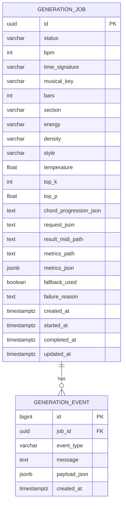

# Result Metadata Schema

작성일: 2026-05-16

현재 모델 MVP는 PostgreSQL을 사용하지 않는다. MIDI와 metrics JSON을 local filesystem에 저장한다. 아래 PostgreSQL ERD는 backend 확장 시 참고용으로만 유지한다.

## 1. Current File-Based Outputs

```text
outputs/
  generated/<job_id>.mid
  metrics/<job_id>.json
```

Metrics JSON:

```json
{
  "job_id": "uuid",
  "status": "COMPLETED",
  "midi_path": "outputs/generated/uuid.mid",
  "metrics_path": "outputs/metrics/uuid.json",
  "fallback_used": false,
  "model_repaired": true,
  "metrics": {
    "generation_time_ms": 15027,
    "note_count": 5,
    "duration_sec": 3.87,
    "note_density": 1.29,
    "dead_air_ratio": 0.75,
    "repetition_score": 0.0,
    "pitch_min": 63,
    "pitch_max": 70,
    "fallback_used": false
  },
  "failure_reason": null,
  "model_failure_reason": null
}
```

## 2. Deferred PostgreSQL ERD



## 2. Table: generation_job

필수 컬럼:

| Column | Type | Required | Description |
|---|---|---:|---|
| `id` | UUID | yes | job id |
| `status` | varchar | yes | `PENDING`, `RUNNING`, `COMPLETED`, `FAILED` |
| `bpm` | int | yes | tempo |
| `time_signature` | varchar | yes | MVP default `4/4` |
| `musical_key` | varchar | no | key, `key` is reserved in some contexts |
| `bars` | int | yes | requested bar count |
| `section` | varchar | yes | intro/build/breakdown/drop |
| `energy` | varchar | yes | low/mid/high |
| `density` | varchar | yes | sparse/medium/dense |
| `style` | varchar | no | style token |
| `temperature` | float | no | generation parameter |
| `top_k` | int | no | generation parameter |
| `top_p` | float | no | generation parameter |
| `chord_progression_json` | text | yes | JSON array string |
| `request_json` | text or jsonb | yes | original request snapshot |
| `result_midi_path` | text | no | generated MIDI path |
| `metrics_path` | text | no | metrics JSON path |
| `metrics_json` | jsonb | no | metrics snapshot |
| `fallback_used` | boolean | yes | default false |
| `failure_reason` | text | no | failure detail |
| `created_at` | timestamptz | yes | created timestamp |
| `started_at` | timestamptz | no | inference start |
| `completed_at` | timestamptz | no | terminal timestamp |
| `updated_at` | timestamptz | yes | updated timestamp |

## 3. Table: generation_event

MVP에서는 선택이다. 구현 시간이 부족하면 생략 가능하다.

용도:

- job lifecycle debugging.
- inference call 기록.
- failure reason 추적.

| Column | Type | Required | Description |
|---|---|---:|---|
| `id` | bigint | yes | event id |
| `job_id` | uuid | yes | generation job id |
| `event_type` | varchar | yes | `CREATED`, `STARTED`, `INFERENCE_COMPLETED`, `FAILED` |
| `message` | text | no | human-readable message |
| `payload_json` | jsonb | no | debug payload |
| `created_at` | timestamptz | yes | timestamp |

## 4. Indexes

권장:

```sql
create index idx_generation_job_status on generation_job(status);
create index idx_generation_job_created_at on generation_job(created_at desc);
create index idx_generation_event_job_id on generation_event(job_id);
```

## 5. MVP 단순화

첫 구현에서는 `generation_event`를 생략해도 된다. 그 경우 `generation_job.failure_reason`, `metrics_json`, application log로 충분하다.
