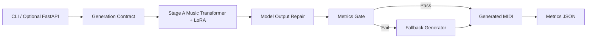

# System Architecture

작성일: 2026-05-16

## 1. 목표 아키텍처

```text
CLI / optional FastAPI wrapper
  -> MIDI Generation Contract
  -> Stage A model generation
  -> Model output repair
  -> Metrics gate
  -> Fallback generator if needed
  -> generated.mid + metrics.json
```

## 2. Mermaid Overview



## 3. Component Responsibilities

### Generation Contract

책임:

- structured musical request 검증.
- 기존 Stage A model-first generation 실행.
- model output repair 적용.
- metrics gate 검사.
- 실패 시 fallback MIDI 생성.
- MIDI path와 metrics JSON 반환.

하지 않는 것:

- Spring Boot job lifecycle.
- PostgreSQL persistence.
- DAW realtime routing.

### Stage A Model

책임:

- `scripts/generate.py` 기반 LoRA Music Transformer 호출.
- `conditioning.mid` primer 기반 MIDI 생성.

### Model Output Repair

책임:

- pitch range octave mapping.
- 첫 note 기준 phrase start 정렬.
- 요청 bars 기준 trim.
- duplicate cleanup.

### Fallback Generator

책임:

- 모델 checkpoint 누락, empty output, gate fail 시 valid MIDI 생성.
- BPM/chords/bars/density/energy를 반영한 simple phrase 생성.

### MIDI Generation Pipeline

책임:

- 기존 LoRA Music Transformer 사용 가능 시 사용.
- output validation.
- fallback phrase generation.
- MIDI post-processing.
- metrics 계산.

### File Storage

MVP에서는 local filesystem을 사용한다.

```text
outputs/
  generated/<job_id>.mid
  metrics/<job_id>.json
```

나중에 S3 또는 object storage로 교체 가능하게 path abstraction만 둔다.

## 4. Request Flow

1. CLI 또는 FastAPI wrapper가 request를 받는다.
2. `GenerationRequest` validation을 수행한다.
3. Stage A model generation을 실행한다.
4. raw model MIDI를 repair한다.
5. metrics gate를 검사한다.
6. 통과하면 repaired model MIDI를 결과로 저장한다.
7. 실패하면 fallback MIDI를 생성한다.
8. metrics JSON에 `fallback_used`, `model_repaired`, 실패 이유를 남긴다.

## 5. Failure Flow

실패 예시:

- invalid chord progression
- model checkpoint missing
- generated MIDI empty
- MIDI decode failure
- inference timeout

처리:

- Python은 가능한 경우 fallback MIDI를 생성한다.
- fallback도 실패하면 error response를 반환한다.
- 결과 JSON에 `status=FAILED`와 `failure_reason`을 남긴다.

## 6. Future Realtime Extension

MVP 이후 realtime 구조:

```text
MIDI Input / DAW
  -> Realtime Prompt Builder
  -> Generation Worker
  -> 1 bar lookahead queue
  -> MIDI Output / DAW
```

현재 MVP는 realtime 전에 먼저 file-based model generation을 안정화하기 위한 기반이다.
