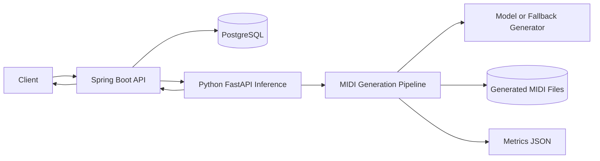

# System Architecture

작성일: 2026-05-16

## 1. 목표 아키텍처

```text
Client / curl / future UI
  -> Spring Boot API
  -> PostgreSQL
  -> Python FastAPI Inference Server
  -> MIDI Generation Pipeline
  -> File Storage
  -> Spring Boot Download API
```

## 2. Mermaid Overview



## 3. Component Responsibilities

### Spring Boot API

책임:

- public REST API 제공.
- request validation.
- generation job 생성.
- job status 관리.
- Python inference 호출.
- result path와 metrics 저장.
- MIDI download 제공.

하지 않는 것:

- MIDI 생성 알고리즘 구현.
- 모델 로딩.
- 학습.

### PostgreSQL

책임:

- generation job metadata 저장.
- request payload 저장.
- result metadata 저장.
- failure reason 저장.

### Python FastAPI Inference

책임:

- model-serving boundary.
- structured request를 MIDI generation input으로 변환.
- generator 실행.
- post-processing.
- metrics 계산.
- result metadata 반환.

하지 않는 것:

- public job lifecycle 관리.
- 사용자 인증.
- 장기 DB persistence.

### MIDI Generation Pipeline

책임:

- 기존 LoRA Music Transformer 사용 가능 시 사용.
- output validation.
- fallback phrase generation.
- MIDI post-processing.
- metrics 계산.

### File Storage

MVP에서는 local filesystem을 사용한다.

```text
outputs/
  generated/<job_id>.mid
  metrics/<job_id>.json
```

나중에 S3 또는 object storage로 교체 가능하게 path abstraction만 둔다.

## 4. Request Flow

1. Client가 `POST /api/generation-jobs` 호출.
2. Spring Boot가 `GenerationJob`을 `PENDING`으로 저장.
3. Spring Boot가 job을 `RUNNING`으로 바꾸고 Python inference를 호출.
4. Python inference가 MIDI를 생성한다.
5. Python inference가 metrics를 계산하고 path를 반환한다.
6. Spring Boot가 job을 `COMPLETED`로 저장한다.
7. Client가 job status를 조회한다.
8. Client가 download endpoint로 MIDI를 받는다.

MVP에서는 synchronous call로 시작해도 된다. 다만 API model은 job status 기반으로 설계한다.

## 5. Failure Flow

실패 예시:

- invalid chord progression
- model checkpoint missing
- generated MIDI empty
- MIDI decode failure
- inference timeout

처리:

- Python은 가능한 경우 fallback MIDI를 생성한다.
- fallback도 실패하면 error response를 반환한다.
- Spring은 job status를 `FAILED`로 저장하고 `failureReason`을 남긴다.

## 6. Future Realtime Extension

MVP 이후 realtime 구조:

```text
MIDI Input / DAW
  -> Realtime Prompt Builder
  -> Generation Worker
  -> 1 bar lookahead queue
  -> MIDI Output / DAW
```

MVP backend는 realtime 전에 먼저 file-based generation을 안정화하기 위한 기반이다.
