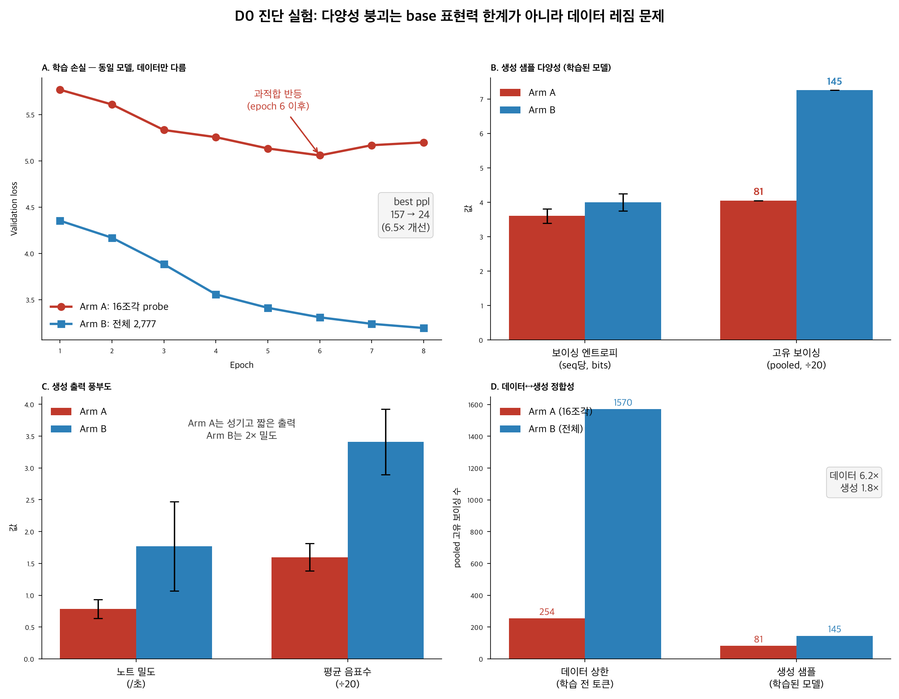

# D0 진단 실험 결과: 다양성 붕괴의 원인

> Issue #1444 / PR #1445 (`scripts/run_d0_experiment.sh`)
> 실행: 2026-07-11, 로컬 MPS (Apple Silicon, 32GB)

## 질문

스타일 파인튜닝에서 관측된 다양성 붕괴(보이싱 다양성 붕괴·화성 진행 반복·장기 구조 붕괴)의 원인은?

- **H1 (base 표현력 한계)**: 모델 아키텍처/용량 자체가 병목.
- **H2 (데이터 레짐)**: 실제 학습에 들어간 데이터가 16조각/5.7만 토큰으로 극소 → 좁은 데이터가 붕괴의 원인.

## 방법

**동일 모델·하이퍼파라미터**로 데이터만 바꿔 from-scratch 학습(두 팔 모두 13,669,923 params, 100% 학습):

| | Arm A (baseline) | Arm B (treatment) |
|---|---|---|
| 학습 데이터 | 16조각 probe | 전체 2,777 코퍼스 |
| train / val 파일 | 16 / 2 | 2,499 / 278 |
| 설정 | epochs=8, batch=4, max_seq=1024, lr=3e-4 | 동일 |

학습 → 각 모델에서 동일 프라이머로 24 샘플 생성 → 생성 샘플 다양성 비교.

## 결과



### 1. 학습 손실 — 결정적 증거

| | Arm A (16조각) | Arm B (전체 2,777) |
|---|---|---|
| best val loss | **5.0585** | **3.1934** |
| perplexity | 157 | 24 |
| 거동 | epoch 6 바닥 → **과적합 반등** (5.06→5.17→5.20) | 8 epoch 내내 **단조 개선** (3.53→3.19) |

**perplexity 6.5배 개선.** base 표현력이 진짜 한계였다면 데이터를 늘려도 손실이 이만큼 떨어질 수 없다. Arm A의 6-epoch 과적합 반등은 전형적인 저데이터 신호(모델이 16조각을 외움).

### 2. 생성 샘플 다양성 (학습된 모델의 실제 출력)

| 지표 | Arm A | Arm B | 변화 |
|---|---|---|---|
| pooled 고유 보이싱 | 81 | 145 | 1.8× |
| 보이싱 엔트로피 /seq (bits) | 3.599±0.213 | 3.997±0.254 | +11% |
| PC 엔트로피 (max 3.58) | 3.285±0.123 | 3.301±0.124 | ≈ |
| 노트 밀도 /초 | 0.787±0.148 | 1.769±0.700 | 2.2× |
| 평균 음표수 /seq | 31.9±4.3 | 68.2±10.2 | 2.1× |

### 3. 데이터↔생성 정합성

학습 전 **데이터 상한**의 pooled 고유 보이싱: probe16 **254** vs full2777 **1,570** (6.2×).
학습된 모델 **생성**의 pooled 고유 보이싱: 81 vs 145 (1.8×).

pooled 보이싱 **엔트로피** 기준으로 상한 대비 도달률을 보면:

| | 데이터 상한 (bits) | 생성 (bits) | 도달률 |
|---|---|---|---|
| Arm A | 4.94 | 4.61 | **93.3%** |
| Arm B | 6.29 | 5.00 | 79.5% |

**Arm A는 자기 데이터의 다양성 상한에 사실상 도달해 있었다** — 모델이 부족했던 게 아니라
데이터의 천장이 낮았던 것. Arm B는 상한이 1.35 bits 높고 도달률 79%라 연장 학습 시 추가
개선 여지가 남아 있다(8 epoch에도 val loss 하강 중이라는 관찰과 일치).

## 결론

**병목은 base 표현력 한계(H1)가 아니라 데이터 레짐(H2)이었다.** 동일 모델이 데이터만 넓히자 perplexity 6.5배 개선, 생성 다양성 전반 상승.

## 다음 방향 (열린 갭)

데이터 상한은 6.2× 넓은데 생성은 1.8×에 그친다 → 데이터를 더 늘리기보다 **학습 길이/모델 용량/샘플링**을 다음 레버로 검토.

## 재현

```bash
# 전제: data/jazz_full/{train,val} 토크나이즈 완료, scripts/checkpoint_utils.py 존재
bash scripts/run_d0_experiment.sh
STAGE=measure bash scripts/run_d0_experiment.sh   # 측정만 재실행
```

## 주의 / 후속 확인 필요

- 생성 로그에 `info removed pitch`가 유효 음역(MIDI 21-108) 안의 값에도 다수 찍힘 → `decode_midi` 필터 로직 점검 필요. 이번 판정에는 영향 없음(살아남은 노트로 지표 계산).
- **distinct_voicing_ratio(샘플당)는 Arm A가 높게 나온다(0.565 vs 0.431) — 길이 아티팩트.**
  Arm A는 샘플당 보이싱이 절반(25.7 vs 50.8)이라 적게 뽑을수록 고유 비율이 자연히 높다.
  풀링 기준 사실상 동률(0.131 vs 0.119)이며, 절대량(81 vs 145)이 올바른 비교다.
- mean_voicing_size 1.2–1.3 → 두 팔 모두 생성이 거의 단선율. 다양성은 회복됐지만 Tatum
  스타일 화성 밀도는 별개의 품질 과제.
